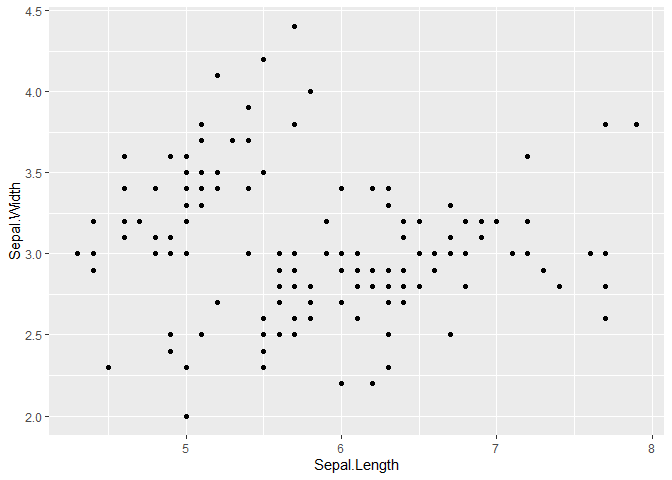

# Tarea 1
Simón Gazze

<script src="demo_files/libs/kePrint-0.0.1/kePrint.js"></script>
<link href="demo_files/libs/lightable-0.0.1/lightable.css" rel="stylesheet" />


Librerias

``` r
#install.packages("kableExtra")

library(ggplot2)
library(dplyr)
library(kableExtra)
```

1)  Figura creada con código de R.

``` r
  ggplot(iris)+ 
  aes(x=Sepal.Length,y=Sepal.Width)+
  geom_point()
```



2)  Figura a partir de un archivo de imagen externo.


3)  Texto con sintaxis Markdown (negrita y cursiva).

*texto* **de** *ejemplo* **para** *Ver* **la** *utilización* **De**
*negrita* **Y** *Cursiva*

4)  Escritura matemática.

Si $\alpha_1$ =
$\alpha_{11} = 5 \Rightarrow \frac{\alpha_1}{\alpha_{11}} \neq 123$

5)  Listas.

``` r
lista_simon = list(1:10, "a","b","c","d")
lista_simon
```

    [[1]]
     [1]  1  2  3  4  5  6  7  8  9 10

    [[2]]
    [1] "a"

    [[3]]
    [1] "b"

    [[4]]
    [1] "c"

    [[5]]
    [1] "d"

6)  Tabla creada con sintaxis Markdown.

| Nombre | Edad | Peso |
|--------|------|------|
| Pepito | 21   | 90   |
| Juan   | 20   | 115  |
| Ramon  | 29   | 100  |

7)Tabla creada con código de R.

``` r
iris_resumen= iris[1:10,]
iris_resumen%>%
  kable() %>%
   kable_styling(full_width = F) 
```

| Sepal.Length | Sepal.Width | Petal.Length | Petal.Width | Species |
|-------------:|------------:|-------------:|------------:|:--------|
|          5.1 |         3.5 |          1.4 |         0.2 | setosa  |
|          4.9 |         3.0 |          1.4 |         0.2 | setosa  |
|          4.7 |         3.2 |          1.3 |         0.2 | setosa  |
|          4.6 |         3.1 |          1.5 |         0.2 | setosa  |
|          5.0 |         3.6 |          1.4 |         0.2 | setosa  |
|          5.4 |         3.9 |          1.7 |         0.4 | setosa  |
|          4.6 |         3.4 |          1.4 |         0.3 | setosa  |
|          5.0 |         3.4 |          1.5 |         0.2 | setosa  |
|          4.4 |         2.9 |          1.4 |         0.2 | setosa  |
|          4.9 |         3.1 |          1.5 |         0.1 | setosa  |

8)  Bloques de código ocultos y visibles.

``` r
print("codigo visible")
```

    [1] "codigo visible"

    [1] "codigo invisible"
